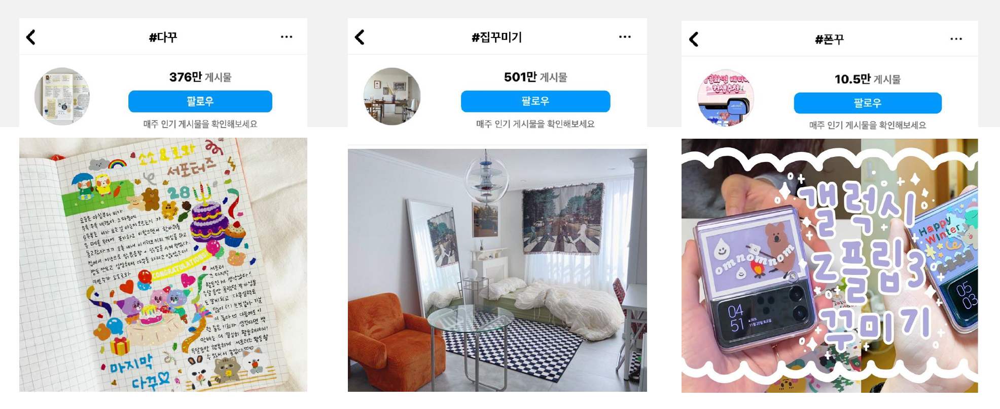
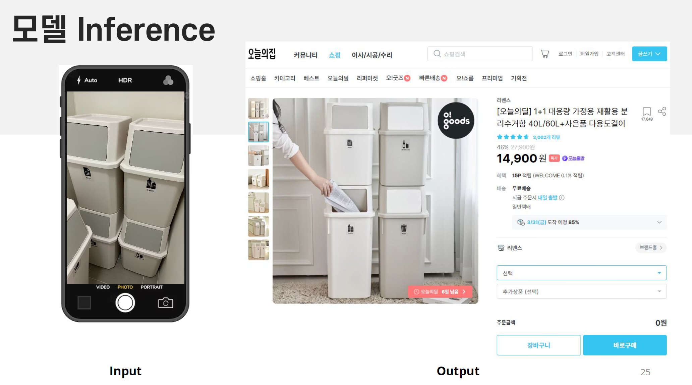
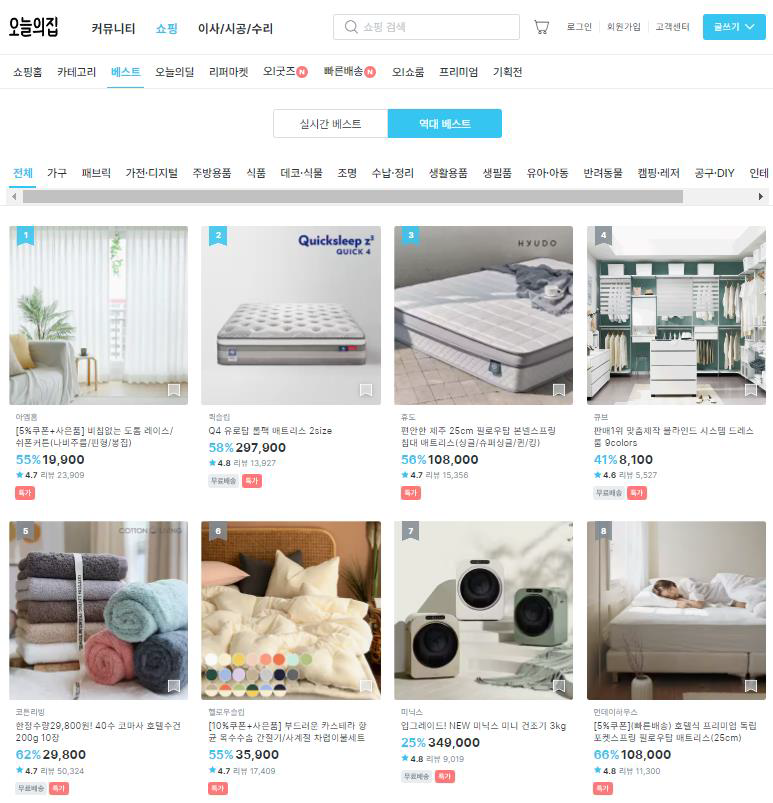

# Project Name : 🪑 Bucketplace-Classification
원하는 가구 이미지를 '오늘의 집(Bucket Place)'홈페이지에서 검색해주는 프로젝트

## Contents Table
- [프로젝트 상세 내용](#프로젝트-상세-내용)
    - [문제 상황](#문제-상황)
    - [기대효과](#기대효과)
    - [Project 설명](#PROJECT-설명)
    - [활용 Dataset](#활용-Dataset)
- [사용 기술 및 라이브러리](#사용-기술-및-라이브러리)
- [담당한 부분](#담당한-부분) 
- [개발 환경](#Environment)
 

## 📖 프로젝트 상세 내용
### 문제 상황

- 2023 공간 디자인 트렌드는 커스터마이징 설계를 통해 자신의 취향과 개성을 반영한 공간, 물품을 만드는 것이라고 한다.

- SNS(Instagram)에서 다꾸(다이어리 꾸미기), 집꾸미기, 폰꾸(폰 꾸미기)등을 검색해 보았을 때 게시물의 수가 매우 많은 것을 볼 수 있다. 이를 통해서 MZ세대는 본인의 취향과 개성을 표현하는데 적극적이라는 것을 알 수 있다.
- 꾸미기를 위해 원하는 제품을 발견했을 때 제품의 이름을 알아야 쉽게 검색할 수 있다.

#### **사진으로 원하는 가구를 자동으로 검색해주는 모델이 필요하다!**

### 기대효과 
- 소비자가 간편하게 원하는 제품을 쉽게 찾을 수 있게 되어 만족도를 높일 수 있다.
- 꾸미기를 원하는 사용자가 특정 제품들을 간단하게 찾을 수 있게 되어 구매로 이어질 가능성을 높아져 플랫폼의 수익을 향상시킬 수 있다.
- 가구나 꾸미는 용품을 판매하는 플랫폼에서 기술을 활용한다면 비슷한 플랫폼 시장에서 경쟁력을 발휘할 수 있다.

### PROJECT 설명 

- VGG19, ResNet50, MobileNet_V3등의 이미지 분류 모델을 학습시킨 후 Ensemble하여 순위가 높은 3개의 제품과 링크를 결과로 도출하는 모델입니다.

### 활용 Dataset

- '오늘의집' 홈페이지의 가구, 가전 등 6개의 카테고리의 54개의 제품 리뷰 사진을 직접 크롤링하였고, 리뷰 사진에 제품이 절반을 차지하지 않거나 다른 상품이 포함된 사진은 제거하여 각 1000장씩 약 54000장을 사용

## 🛠️ 사용 기술 및 라이브러리
- Selenium
- Matplotlib, Scikit-learn
- Tensorflow, Keras
- Alexnet, VGGNet(VGG19), GoogLeNet, MobileNet

## 담당한 부분
- 데이터 전처리, Augmentation(증강) 진행
- VGGNet, MobileNet 모델 학습
- 전체 모델 Ensemble, Inference용 코드 구축

## 🗃️ Environment

| Env |CPU | GPU | RAM | OS 
|:--:|:--:|:--:|:--:|:--:|
| Local | i5- 10400F | RTX-3080(12G) | 32G| Window10 |
| AWS |  AMD-EPYC-7R32 | RTX-3090| 12G| Ubuntu |
| Colab + | intel Xeon | A100 | 80G | Ubuntu |